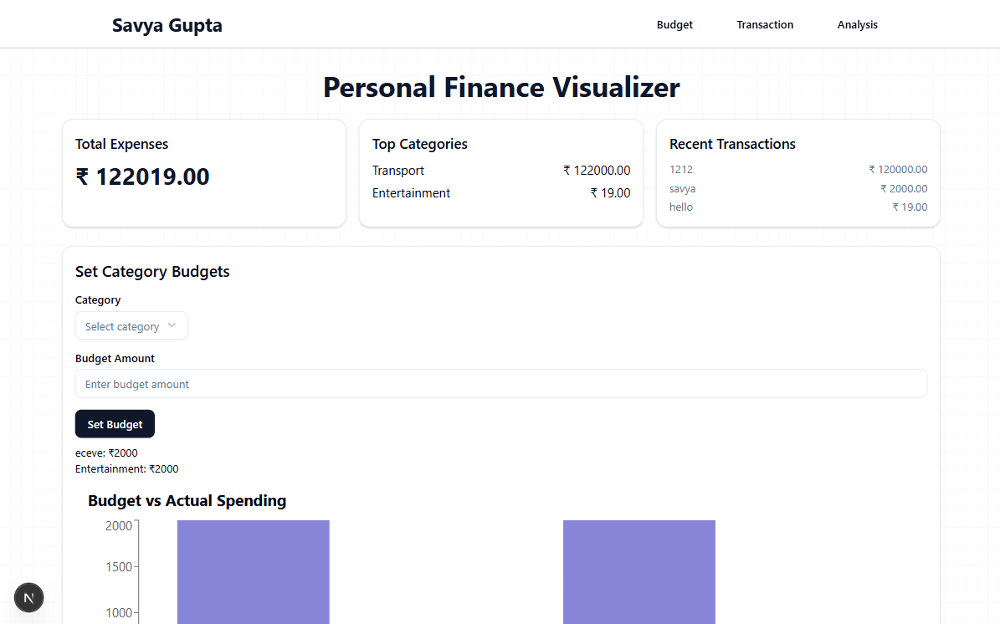
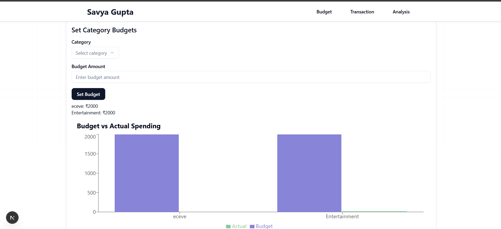
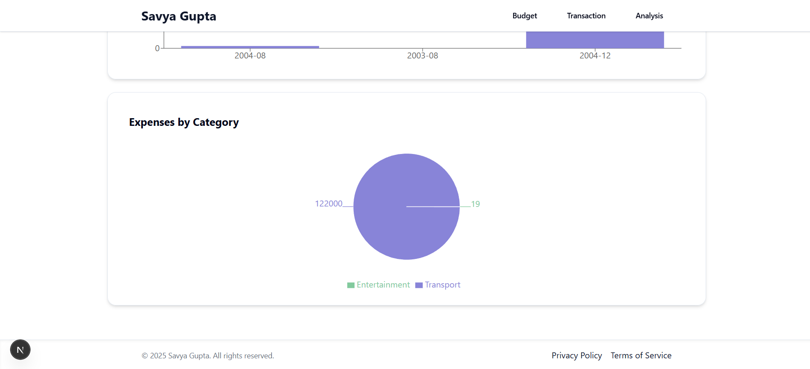
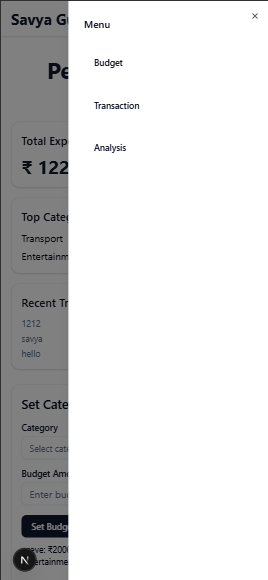

# 💰 Personal Finance Visualizer

A modern, responsive **full-stack web application** for visualizing and managing personal finances.

> 📌 **Stage 1 of Full-Stack Developer Internship Assignment**  
> Author: **Savya Gupta**

---

---

## 🚀 Features

✅ Add, Edit, Delete personal finance transactions  
✅ Track expenses with category budgets  
✅ Budget vs Actual comparison chart  
✅ Monthly expenses bar chart  
✅ Category-wise expense pie chart  
✅ Spending insights and analysis  
✅ Responsive UI with dark mode support  
✅ Smooth anchor scrolling for sections  
✅ User-friendly empty states with illustrations  
✅ Built with **Next.js App Router** and **Tailwind CSS**

---

## 📸 Screenshots

> 💡 **Recommended screenshots to include:**  
✔️ Hero/Home page (whole app view)  
✔️ Add Transaction form  
✔️ Transaction List  
✔️ Budget Form + comparison chart  
✔️ Expense Chart (bar chart)  
✔️ Category Pie Chart  
✔️ Mobile responsive navbar / sidebar

| Hero/Home Page                                      | Add Transaction                                     | Transaction List                                      |
| --------------------------------------------------- | --------------------------------------------------- | ----------------------------------------------------- |
|                        |              |              |

| Budget & Comparison                                | Expense Chart                                       | Category Pie Chart                                    |
| --------------------------------------------------- | --------------------------------------------------- | ----------------------------------------------------- |
|         |            |             |

| Mobile Sidebar                                      |
| --------------------------------------------------- |
|           |

---

## 🛠️ Tech Stack

- **Frontend:** Next.js (App Router), React
- **Styling:** Tailwind CSS, shadcn/ui
- **Charts:** Recharts
- **Backend:** Next.js API Routes
- **Database:** MongoDB

---

## ✨ Stage 1 Assignment Requirements

✅ Add/Edit/Delete transactions (amount, date, description, category)  
✅ Transaction list with responsive design  
✅ Chart(s) to visualize expenses over time  
✅ Category budgets with comparison  
✅ Insights/analysis on spending  
✅ Smooth scrolling navigation with anchor links  
✅ Form validation and error handling  
✅ Empty states with illustrations  

---

## 📦 Suggested Folder Structure

/app
/api
/transactions (CRUD API)
/budgets (CRUD API)
/components
BudgetForm
TransactionForm
TransactionList
DashboardCards
ExpenseChart
CategoryPieChart
BudgetComparisonChart
SpendingInsights
Navbar
Footer
/screenshots
/page.js
## 🧪 Local Development

### 1️⃣ Clone the repository
git clone https://github.com/YOUR_USERNAME/YOUR_REPO_NAME.git
cd YOUR_REPO_NAME
Install dependencies
npm install
3️⃣ Add Environment Variables
Create a .env.local file:
MONGODB_URI=mongodb+srv://YOUR_CONNECTION_STRING
4️⃣ Run the app
npm run dev
Your app will be available at:
http://localhost:3000

👤 Author
Developed by Savya Gupta
For Full-Stack Developer Internship Assignment – Stage 3
