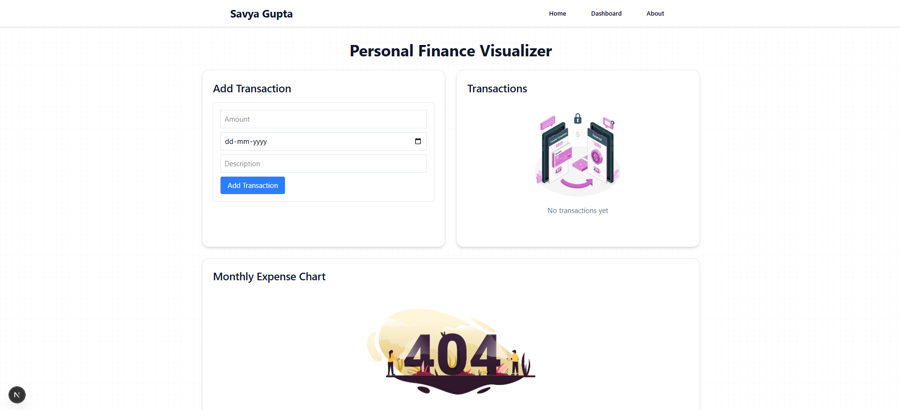
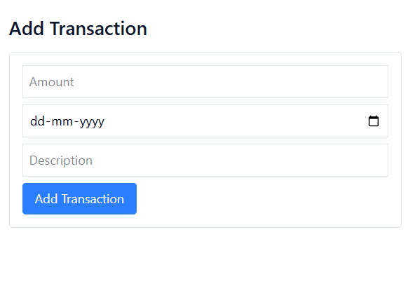
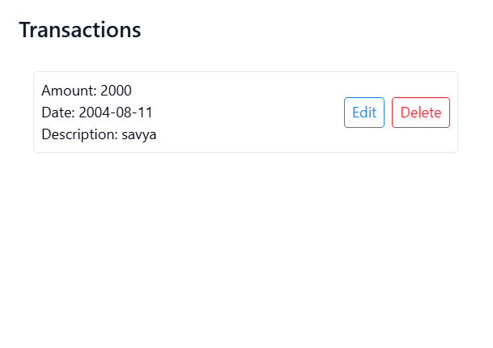
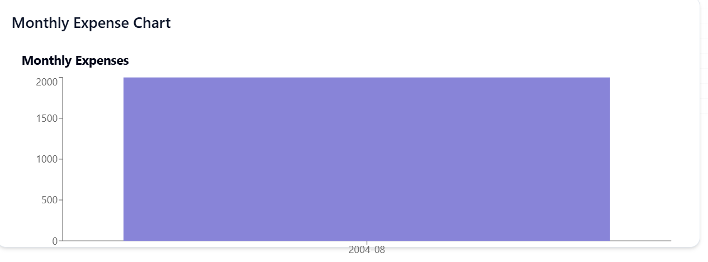

# 💰 Personal Finance Visualizer

A simple, modern, and responsive full-stack web application for tracking personal finances.  

> 📌 Stage 1 of Full-Stack Developer Internship Assignment

---



---

## 🚀 Features

✅ Add, Edit, Delete personal finance transactions  
✅ Transaction list view with real-time updates  
✅ Monthly expenses bar chart (Recharts)  
✅ Responsive, professional UI (Tailwind CSS + shadcn/ui)  
✅ Empty states with placeholder illustrations  
✅ Basic form validation with user-friendly error states

---

## 📸 Screenshots

| Add Transaction | Transaction List | Expense Chart |
|------------------|------------------|----------------|
|  |  |  |

---

## 🛠️ Tech Stack

- **Frontend:** Next.js (App Router), React
- **Styling:** Tailwind CSS, shadcn/ui
- **Charts:** Recharts
- **Backend:** Next.js API Routes
- **Database:** MongoDB

---

## ✨ Stage 1 Assignment Requirements

✅ Add/Edit/Delete transactions (amount, date, description)  
✅ Transaction list view with responsive design  
✅ Single chart: Monthly expenses bar chart  
✅ Basic form validation  
✅ Error states and empty-state illustrations

---

## 📦 Folder Structure

/app
/api
/transactions (API routes for CRUD)
/components
/TransactionForm
/TransactionList
/ExpenseChart
/Navbar
/Footer
/page.js (Main UI layout)

yaml
Copy
Edit

---

## 🧪 Local Development

### 1️⃣ Clone the repository

```bash
git clone https://github.com/YOUR_USERNAME/YOUR_REPO_NAME.git
cd YOUR_REPO_NAME
Install dependencies
npm install
Add Environment Variables
Create a .env.local file:
MONGODB_URI=mongodb+srv://YOUR_CONNECTION_STRING
Run the app
npm run dev
Your app will be available at http://localhost:3000

👤 Author
Savya Gupta
